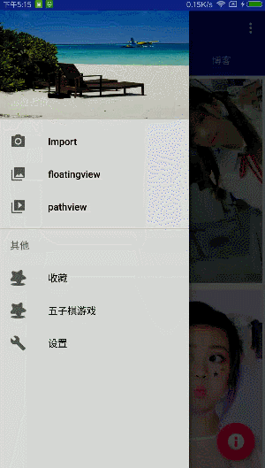

# KotlinMVPRxJava2Dagger2GreenDaoRetrofitDemo
Kotlin+RxJava2+Dagger2+RxCache+Retrofit+GoogleMVPMode+GreenDao

An android app example that I  exercise.

# 欢迎页
利用RxJava2实现右上角倒计时功能.
ps:倒计时已更新,自定义ProgressBar

老版本中:

# 引导页
贝塞尔效果切页指示器

#自定义view 五子棋(ps:gif录制有丢帧现象,具体效果还要安装试看)

/***** 未完待续  *****/

